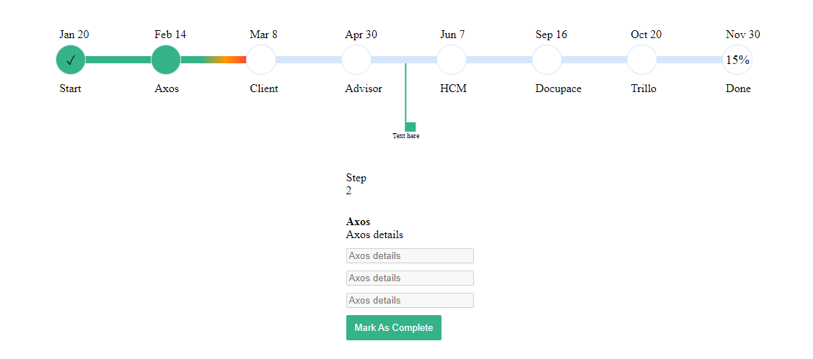

# Timeline Project in Angular

This project is an Angular-based application that visualizes a series of steps in a timeline format. Each step is represented by a circle on a progress bar. The application allows users to mark steps as complete, and it dynamically updates the progress bar and percentage of completion. Additionally, it includes a feature that visualizes deadlines with a color gradient indicating time progression.

## Features

- **Step Representation:** Circles represent each step in the progress bar.
- **Completion Tracking:** A button to mark each step as complete.
- **Progress Percentage:** Displays the percentage of steps completed.
- **Deadline Visualization:** Progress bar shows time progression with color gradients:
  - **Green:** Indicates initial phase within the deadline.
  - **Green to Orange Gradient:** Indicates middle phase as the deadline approaches.
  - **Green to Orange to Red Gradient:** Indicates the final phase after the deadline has passed.
- **Step Information Display:** Shows details or requirements of the current step below the timeline.

## Screenshot



## Installation

1. **Clone the repository:**
   ```bash
   git clone https://github.com/yourusername/timeline-project.git
   cd timeline-project
   ```

2. **Install dependencies:**
   ```bash
   npm install
   ```

3. **Run the application:**
   ```bash
   ng serve
   ```
   Navigate to `http://localhost:4200/` in your browser to see the application.

## Usage

1. **Adding Steps:** 
   - Input the steps into the application. Each step will be represented by a circle on the progress bar.

2. **Marking Steps as Complete:**
   - Click the "Mark as Complete" button to complete a step. The progress bar and percentage will update accordingly.

3. **Viewing Step Information:**
   - The application will display information about the current step below the timeline. This could include data related to the step or what is needed to complete it.

4. **Deadline Visualization:**
   - The progress bar will visually indicate the time progression for each step with color gradients:
     - A third of the time passed: Green color.
     - Two-thirds of the time passed: Green to Orange gradient.
     - After the deadline: Green, Orange, and Red gradient until the step is marked as complete.

## Project Structure

- `src/app`: Contains the main application files.
  - `app.component.ts`: Main component logic.
  - `app.component.html`: Main component template.
  - `app.component.css`: Main component styles.
  - `timeline.component.ts`: Component logic for the progress bar.
  - `timeline.component.html`: Template for the progress bar.
  - `timeline.component.css`: Styles for the progress bar.

## Contributing

1. Fork the repository.
2. Create a new branch (`git checkout -b feature-branch`).
3. Commit your changes (`git commit -am 'Add new feature'`).
4. Push to the branch (`git push origin feature-branch`).
5. Create a new Pull Request.

## License

This project is licensed under the MIT License - see the [LICENSE](LICENSE) file for details.

---
